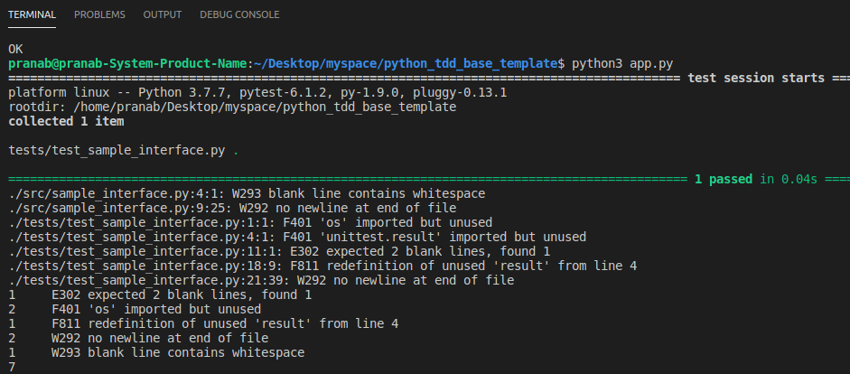

# python_tdd_base_template

## Overview

This is a simple Python Based Template, where we can leverage the benfits of test driven development without any infrastucture dependency and follow the `PEP-8` standard.

## Steps - Involved

1. We have to write their code in the `src` directory with their testcases inside the `tests` directory.

2. The request/responce for the respective python module should be maintained inside the `tests/fixtures` directory in `.json` format.

3. We can check their code by executing `python app.py` inside their terminal/command prompt.

If there is any error/warning in their code, we can watch the details inside the terminal/command prompt as shown in the picture above and fix accordingly

## Setup Guide

Python Version: `3.7.7`

First of all, clone this using terminal/command prompt after running-

`git clone https://github.com/pranabsarkar/python_tdd_base_template.git`

Once, it is cloned move into the directory-

`cd python_tdd_base_template`

Please open terminal/command prompt in the current directory and run this command to insatall the dependencies-

`pip install -r requirements.txt`

Open terminal/command prompt and run this command to start the application-

`python app.py `

## Reference

1. [PyTest](https://docs.pytest.org/en/latest/)
2. [flake8](https://flake8.pycqa.org/en/latest/)
3. [Test Driven Development](https://en.wikipedia.org/wiki/Test-driven_development) 

## Author

Name: Pranab Sarkar

Please feel free to add your input's :)

